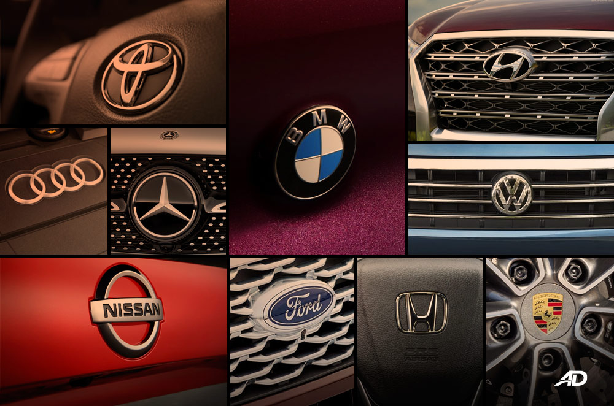

<h1 align="center">
Car Brand Classification
</h1>

# About the Project

A simple web app using Flask framework which predicts the car brand upon uploading the car image. In this project I have trained the model using images of Audi, Lambhorgini and Mercedes. The model is build using one of the transfer learning methods, Resnet50 architecture. 

## Technologies
* Python

## IDE and Packages 
* [Python](https://www.python.org/downloads/release/python-380/)
* [numpy](https://numpy.org/install/)
* [tensorflow](https://www.tensorflow.org/install)
* [matplotlib](https://pypi.org/project/matplotlib/)
* [pip](https://pypi.org/project/pip/)

## Versions
* Python 3.8
* pip 20.2.4
* numpy 1.19.4
* tensorflow 2.4.1
* matplotlib 3.3.2
